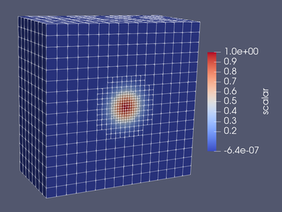

# Trixi2Vtk.jl

[](https://trixi-framework.github.io/TrixiDocumentation/stable/visualization/#Trixi2Vtk)
[](https://github.com/trixi-framework/Trixi2Vtk.jl/actions?query=workflow%3ACI)
[](https://coveralls.io/github/trixi-framework/Trixi2Vtk.jl?branch=main)
[](https://opensource.org/licenses/MIT)
[](https://doi.org/10.5281/zenodo.5221552)
<!-- [](https://github.com/trixi-framework/Trixi2Vtk.jl) -->

With **Trixi2Vtk.jl** you can convert the HDF5-based output files created by
[Trixi.jl](https://github.com/trixi-framework/Trixi.jl) (solution or restart
files) to VTK files. The converted files can then be further processed with
[ParaView](https://www.paraview.org) or [VisIt](https://visit.llnl.gov) to
generate publication-quality visualizations. Trixi2Vtk is part of the
[Trixi framework](https://github.com/trixi-framework).


## Installation
If you have not yet installed Julia, please [follow the instructions for your
operating system](https://julialang.org/downloads/platform/). Trixi2Vtk works
with Julia v1.10 and newer.

Trixi2Vtk is a registered Julia package. Hence, you can install it by executing
the following commands in the Julia REPL:
```julia
julia> import Pkg; Pkg.add("Trixi2Vtk")
```

To update an existing installation of Trixi2Vtk to the
[latest release](https://github.com/trixi-framework/Trixi2Vtk.jl/releases/latest),
execute
```julia
julia> import Pkg; Pkg.update("Trixi2Vtk"); Pkg.status("Trixi2Vtk")
```
in the Julia REPL. A brief list of notable changes to Trixi2Vtk is available in
[`NEWS.md`](NEWS.md).

## Usage
In the Julia REPL, first load the package Trixi2Vtk
```julia
julia> using Trixi2Vtk
```
To process an HDF5 file generated by Trixi.jl, execute
```julia
julia> trixi2vtk(joinpath("out", "solution_000000.h5"), output_directory="out")
```
This will create two unstructured VTK files in the `out/` subdirectory that can
be opened with ParaView or VisIt: `solution_000000.vtu` contains the
discontinuous Galerkin solution data while `solution_000000_celldata.vtu` holds
any cell-based values such as the current AMR indicator or the cell refinement
level.
<p align="center">
  
</p>

For further information on how to use Trixi with Trixi2Vtk, please refer to the
[documentation of Trixi](https://trixi-framework.github.io/Trixi.jl/stable/).


## Authors
Trixi2Vtk is maintained by the
[Trixi authors](https://github.com/trixi-framework/Trixi.jl/blob/main/AUTHORS.md).
Its principal developers are
[Michael Schlottke-Lakemper](https://www.hlrs.de/people/schlottke-lakemper)
(University of Stuttgart, Germany) and [Hendrik Ranocha](https://ranocha.de)
(University of Mainz, Germany).


## License and contributing
Trixi2Vtk is licensed under the MIT license (see [LICENSE.md](LICENSE.md)).
